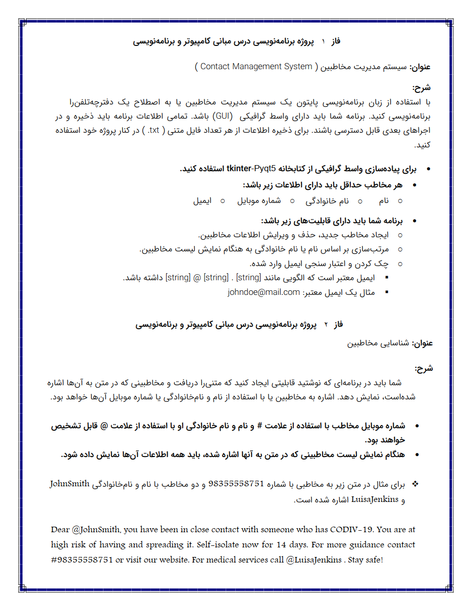
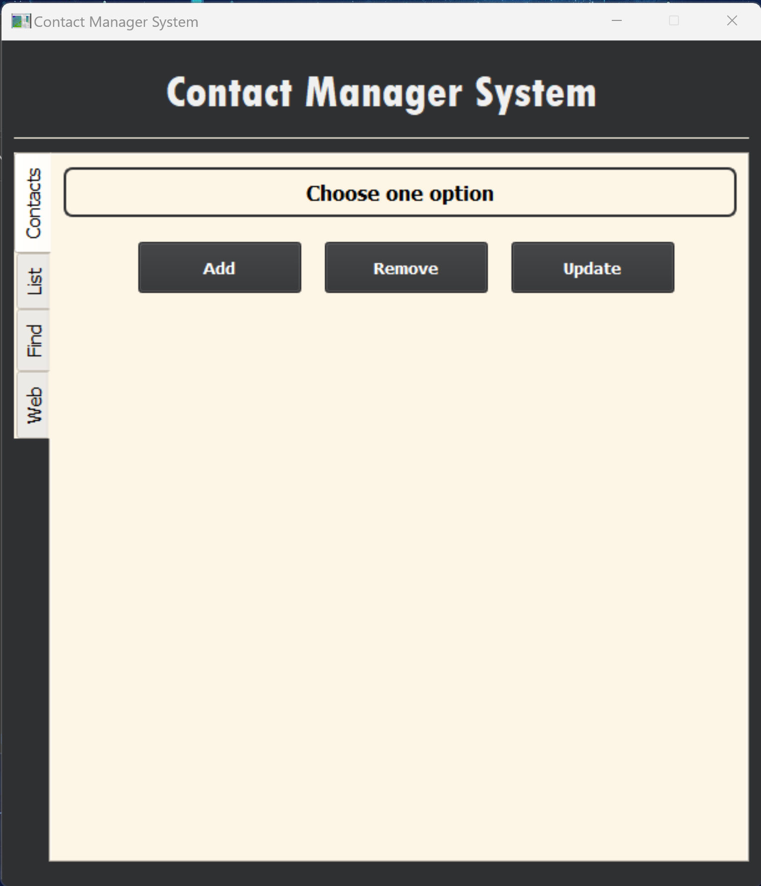
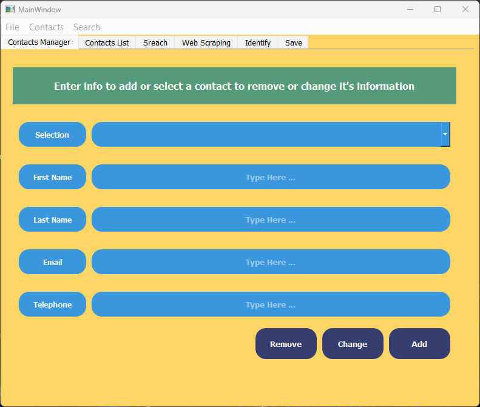
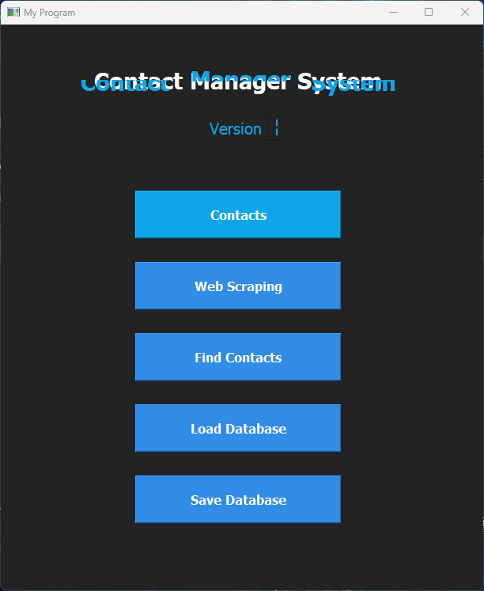
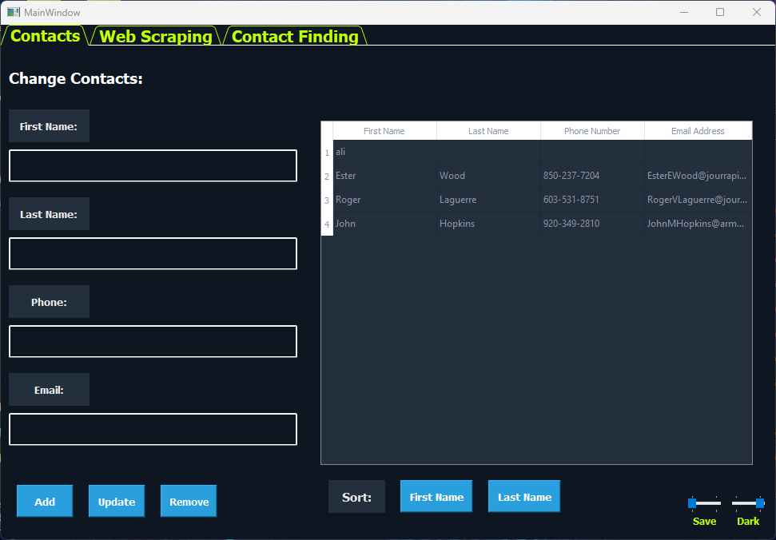
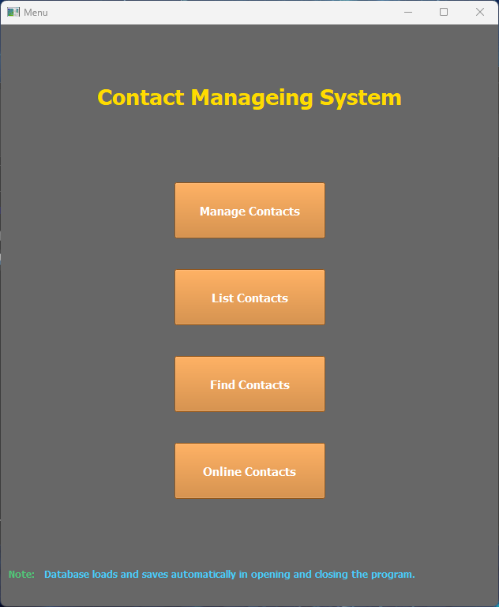
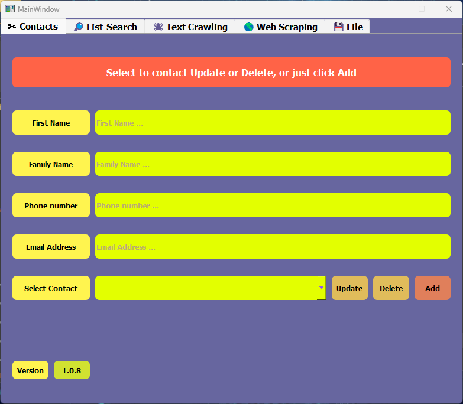
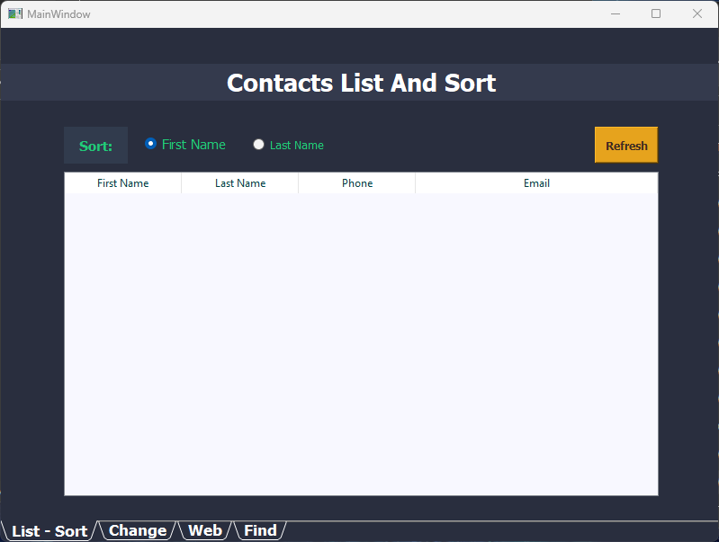
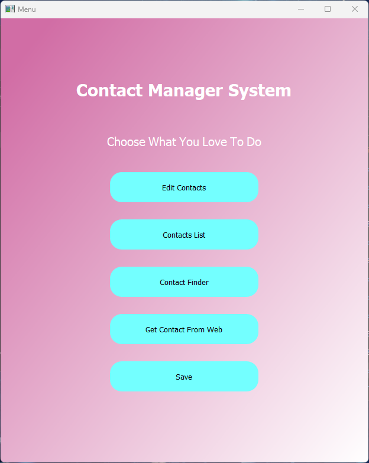
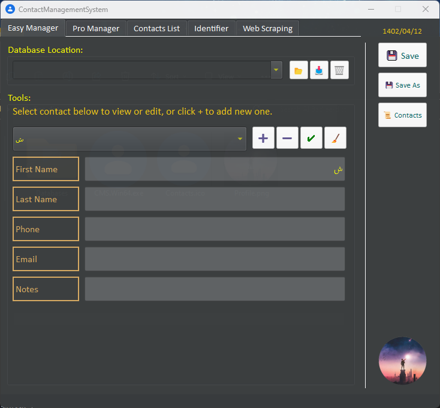

# 👤 Contact Management System | سیستم مدیریت مخاطب

**A university project in which a Content Management System (CMS) is designed with Python and PyQT5.**

**یک پروژه دانشگاهی که در آن یک سیستم مدیریت مخاطب (CMS) با پایتون و PyQT5 طراحی می‌شود.**

# 💬 **نکات پروژه**

* عکس‌های برنامه در دایرکتوری ScreenShots قرار دارند.
* برای اجرا برنامه، به پایتون بالاتر از نسخه 3.6 نیاز دارید.
* کتابخانه‌های مورد نیاز در فایل requirements.txt قرار دارند.
* فایل اجرایی (exe) در قسمت release قرار دارد.
* پروژه اصلی در دایرکتوری AliBadiee نگه داری میشود. ۱۰ پروژه‌ی دیگر محتوای یکسان دارند ولی با روش‌های مختلفی پیاده‌سازی شده‌اند و ظاهر متفاوتی نیز دارند.
* برای دسترسی به همه‌ی پروژه‌های دانشگاهی من، به این لینک مراجعه کنید:

👈🏻 **[پروژه‌های دانشگاهی من](https://github.com/bestmahdi2/Uni__Bachelors_SKU_Path)**

# 📝 **توضیحات پروژه**

# 🖼 **عکس‌های پروژه**

  
  
  
  
  
  
  
  
  
  
  

  

  

  

